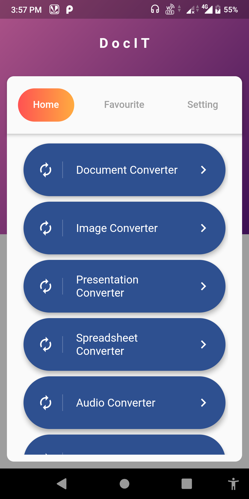
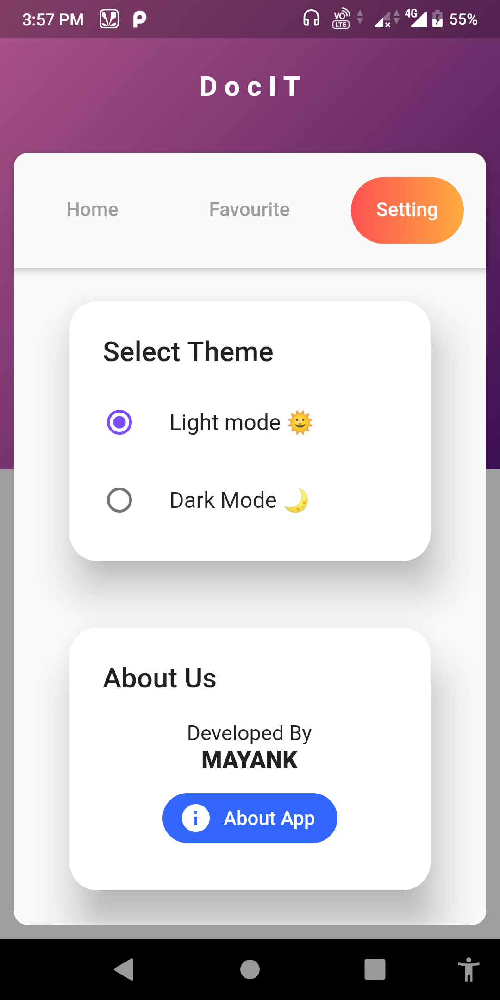
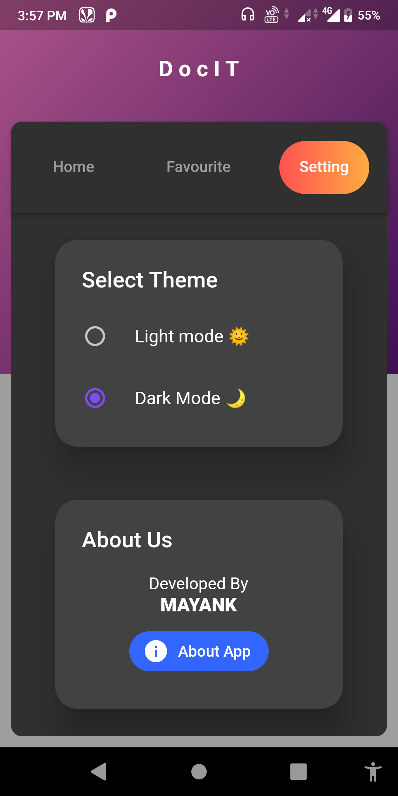
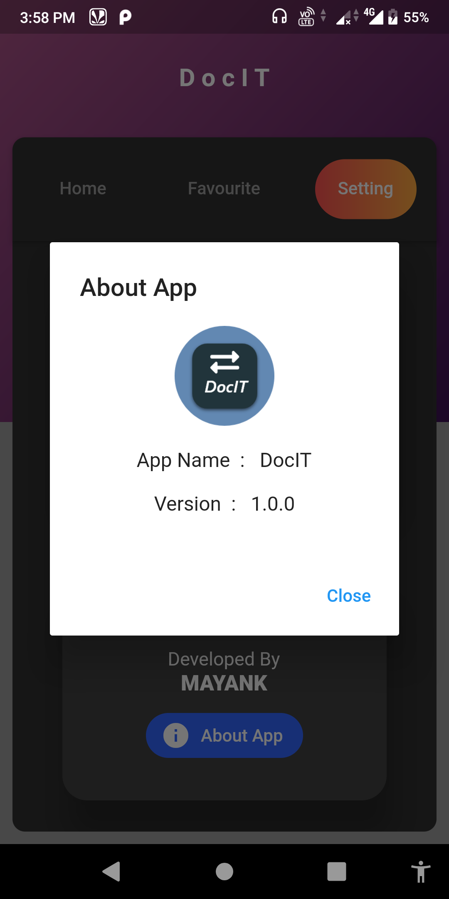
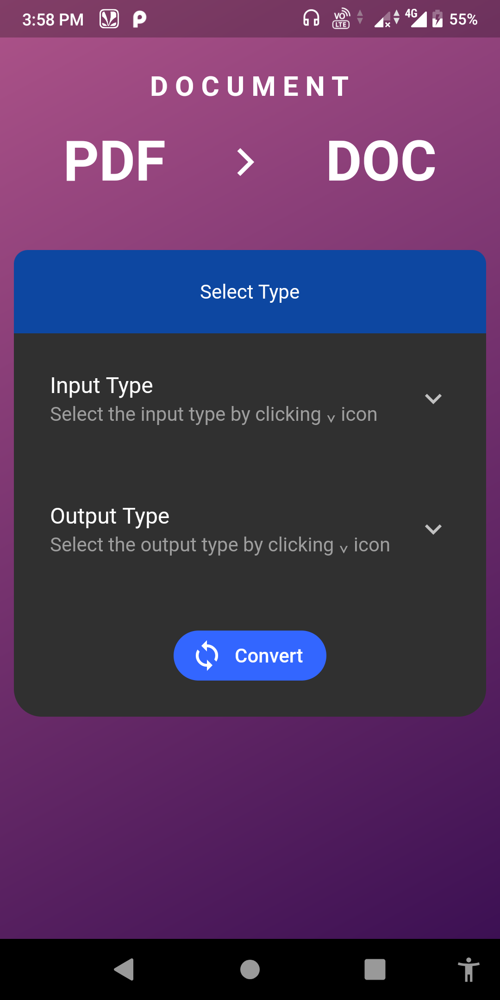
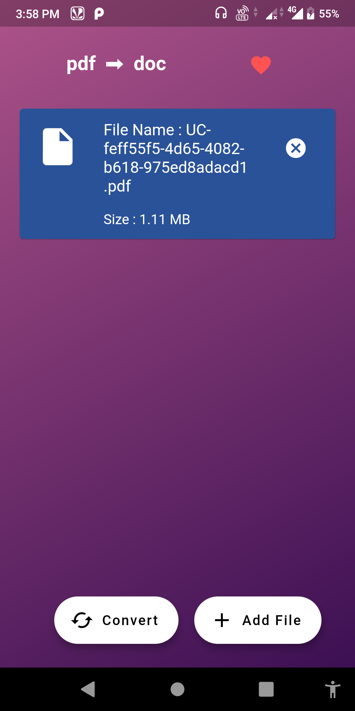
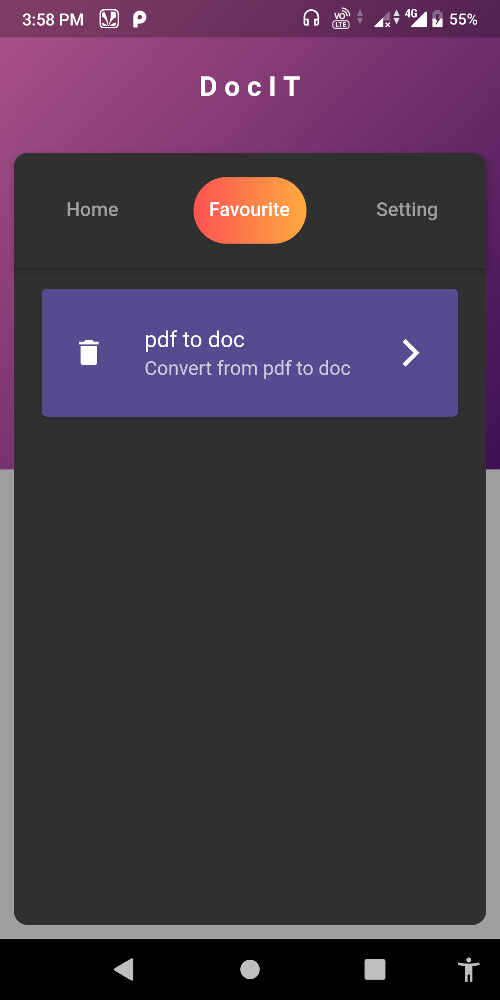

# Docit

DocIt is an android app made by using <b>flutter</b> for converting your favourite files.

Check out the app [here](apk_file\app-release.apk)

## Screenshots
</img>
</img>
</img>
</img>
</img>
</img>
</img>

## About Project
This application is made by using flutterv1.12.13 + hotfix.5. Flutter is based on dart programming language, you can learn dart from [here](https://dart.dev/guides).

For flutter documentation check out there official <a href="https://flutter.dev/docs">site</a>. 

For converting files we have used free api service from <b>CLOUDCONVERT</b>. Check out there [site](https://cloudconvert.com/).

This application supports +200 file formats which can be converted to your desired file type.

## Contributing
Pull requests are welcome. For major changes, please open an issue first to discuss what you would like to change.

Please make sure to update tests as appropriate.

## License
[MIT](https://choosealicense.com/licenses/mit/)
